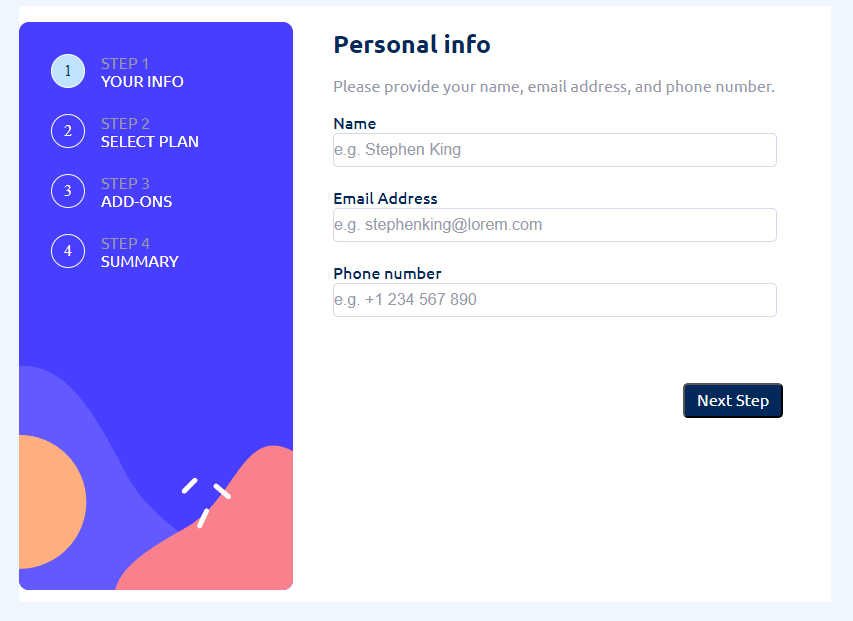
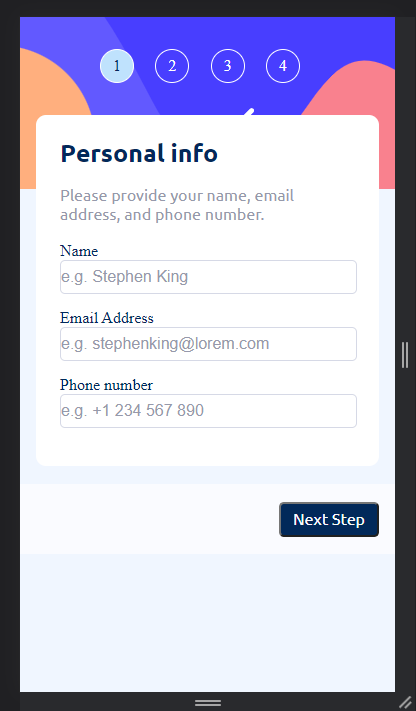

# Frontend Mentor - Multi-step form

# Multi-step Form

This project is a multi-step form that allows users to input information across several pages. The purpose of this project is to learn more about HTML, CSS, and JavaScript and implement them to create a form that works well on both desktop and mobile devices.

## Technologies

The following technologies were used to build this project:

HTML
CSS
JavaScript
LocalStorage

## Installation

To install this project, you can download the files from GitHub and open the index.html file in your web browser.

## Features

The key features of this project include:

Media queries to swap between mobile and desktop views
Multi-step form with progress bar
Saving user input data to LocalStorage
Displaying total cost at the final step
Known Issues
There are currently a few issues with LocalStorage that are being worked on.

## Contributing

To contribute to this project, please submit a pull request with your changes.

## License

This project is attributed to Frontend Mentor.

## Screenshots

### Desktop version

Multi-step Form desktop screenshot

### Mobile version

Multi-step Form mobile screenshot

